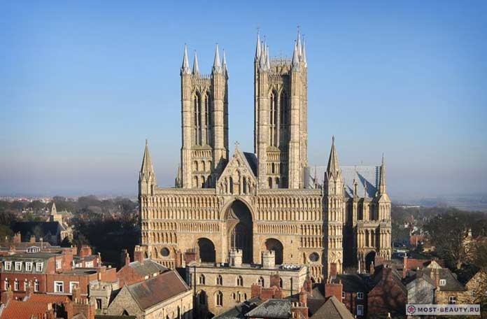

# Кардиф

[TOC]

*
Карта города
*

## Описание

Бри — относительно крупный город [дроу](/population/#drou) с населением около 40 тысяч человек, столица одноимённой области и единственный порт [Врано](/geography/kingdom-of-vrano).

За власть в городе борются два дома дроу — Муар и Деррет, примерно поровну делящие территории внутри городских стен. За пределами стен живут семьи простых дроу, не принадлежащих ни к одному из домов, и всё людское население города.

## Население

За пределами городских стен в районе, называемом Нижним городом, в двух-трёхэтажных домах живёт 3/4 всего населения, включая всех представителей отличных от дроу рас. Здесь люди находятся в явном меньшинстве — их не более 1/4 от всего населения Нижнего города. Остальное население Нижнего города состоит из не благородных семей дроу.

Верхний город (тот, что за стенами) делят примерно поровну два благородных дома дроу и их слуги.

## Районы города

### Нижний город

Нижний город застроен типичными для дроу двух-трёхэтажными каменными зданиями в готическом стиле с высокими крутыми крышами и узкими стрельчатыми окнами. Многие из них имеют двор, обнесённый каменной стеной высотой минимум в полтора человеческих роста, некоторые сами сходятся фасадами одной сплошной стеной, огораживающий дворик внутри квартала — такие, как правило, принадлежат какой-то одной семье. Также здесь находятся торговая улица, несколько таверн и прочих различных заведений.

### Верхний город

Это обнесённая стенами основная часть города, принадлежащая двум крупным домам — Деррет и Муар. Единственные ворота ведут на улицу, разделяющую их владения — дома без окон на первых этажах по её сторонам больше похожи на крепости. Вглубь от "границы" дома приобретают более привычный вид, в них появляется даже немного помпезности — стрельчатые окна застеклены витражами, а крыши венчают золотые флюгеры.

#### Дворец дома Деррет

Величественный дворец, возвышающийся над всем городом, принадлежит дому Деррет, ныне доминирующему в городе. Это дом Верховной матери и наиболее близких членов её семьи. Здесь же мать Деррет принимает различные официальные делегации.

*
Как-то так выглядит этот дворец
*

#### Храм Лолс

Главный храм богини находится на территории дома Муар. Это гигантский собор, самыми высокими своими шпилями почти достигающий высоты дворца. Главную башню, видную со всех сторон города, украшает красивый круглый витраж с изображением священного символа богини.

#### Порт

Портовые склады начинаются прямо за главным храмом. Несмотря на то, что причалы не укрыты бухтой, здесь даже во время шторма всегда тихо — спасибо за это божественной магии Лолс. Порт достаточно крупный для того, чтобы быть способным принять любые корабли. Отсюда можно добраться до любого города на [Великом море](/geography/#velikoe-more).

