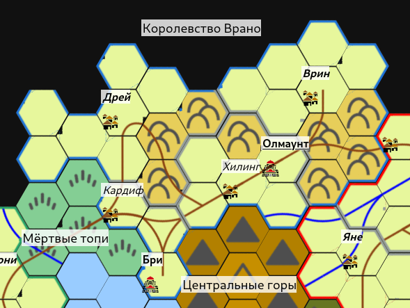

# Королевство Врано

[TOC]

*
Королевство Врано
*

Королевство Врано занимает холмистые земли на севере Осколка. На западе оно граничит с [Мёртвыми топями](/geography), которые проводят естественную сухопутную границу с [Морским Союзом](/geography/sea-union), а на востоке от основной части [королевства Астерлей](/geography/kingdom-of-asterlay) его отделяет труднопересекаемая река Астерлей.

Королевство является основным источником полезных ископаемых для всего Осколка. Ранее роль основных шахтёров выполняли [дварфы](/population/#drugie-rasy), чьи независимые города располагались под холмами и внутри [Центральных гор](/geography/#tsentralnye-gory), а люди выступали их торговыми посредниками. Но Королевству не повезло иметь под собой город [тёмных эльфов](/population/#drou).

Переломный момент наступил 500 лет назад, когда дроу решили, что Подземья им мало, и напали на поверхность. Люди покорились им быстро, принеся клятву верности буквально через месяц войны и десяток сожжёных городов и деревень. А вот Дварфы, их кровные враги, оказывали сопротивление ещё с десяток лет, пока не завершилась осада их последней крепости на северных склонах Центральных гор и последний дварф в королевстве Врано не пал от меча тёмного эльфа.

Дроу, заняв доминирующее положение в обществе королевства, не стали прерывать отношения Врано с остальным Осколком, но войны между королевствами с тех пор стали вестись гораздо чаще.
