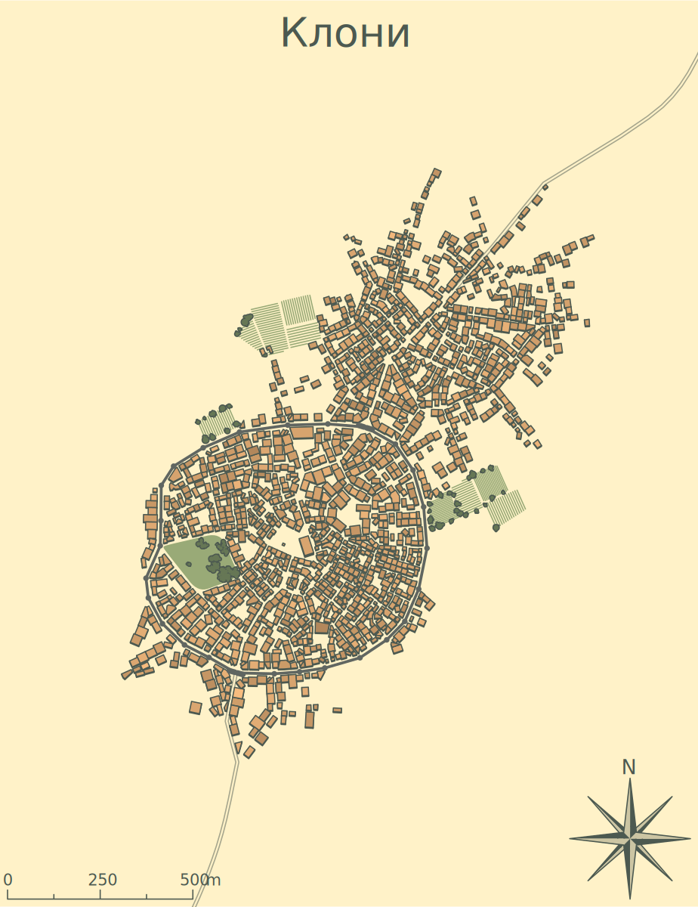

# Клони

[TOC]

*
Карта города
*

## Описание

Клони — среднего размера город, в котором живёт около 10 тысяч жителей, расположенный на самой границе [Мёртвых топей](/geography/#miortvye-topi). Он управляется Городским советом из 12 человек, избираемых сроком на два года либо за выдающиеся заслуги бессрочно на должность почётного члена Совета. Так как город расположен на самой границе с Мёрвыми топями, [Морской союз](/geography/sea-union) держит здесь большой гарнизон, распределённый по заставам вдоль болот.

Основная часть города окружена восьмиметровой каменной стеной, но за последние 100 лет город начал разрастаться на север, в сторону болот.

На центральной площади города стоит трёхэтажная ратуша, из крыши которой торчит небольшая башенка с часами. Недалеко от площади расположен парк, разбитый стоящей рядом с ним Академией исследования топей. У северной стены стоят большие казармы, способные разместить до 20 тысяч солдат, но большую часть времени полупустые.
