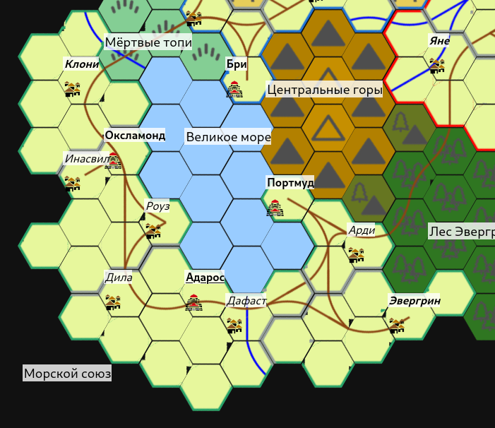

# Морской Союз

[TOC]

*
Морской Союз
*

Морской Союз — это государство, выросшее из объединения независимых городов-государств и подконтрольных им территорий. Союзом управляет Верховный совет в Адаросе, собранный из представителей всех входящих в него городов, причём представители трёх крупнейших — Оксламонда, Адароса и Портмуда, занимают в совете большинство мест, оставляя малым городам, большая часть из которых даже не имеет самоуправления и входит в состав провинций более крупных, лишь треть мест.

## Крупные города

* [Адарос](adaros)
* [Оксламонд](oxlamond)
* [Портмуд](portmud)

##  Малые города

* [Клони](clony)
* Инасвил
* Роуз
* Дила
* Дафаст
* Арди
* Эвергрин
