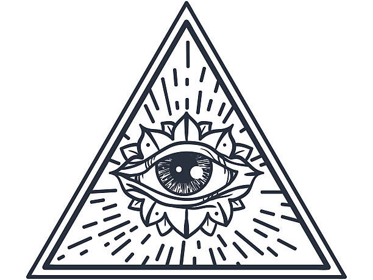

# Организации

[TOC]

## Религиозные течения

### Церковь Великого Солнца

*
Священный знак Великого Солнца
*

Это единая централизованная религия всего Осколка. Большинство жителей поклоняются Великому Солнцу, которое позволило миру, поражённому Катаклизмом, не умереть окончательно, а жить в надежде на то, что все осколки когда-нибудь вновь соединяться. Говорят, что перед этим Осколку будут три знамения:

1. Образуется множество культов, славящих своих ложных богов;
2. Демоны выйдут из Бездны и начнут вторгаться на Осколок;
3. Придёт мессия и уведёт Осколок на воссоединение с единым Миром.

Некоторые считают, что появление Тех, кто знают предвещает первое знамение, но им вторят, что у эльфов испокон веков свои собственные боги, а демоны вторгаться и не начинали. Кроме того, культов должны быть многие десятки, а Те, кто знают — это лишь один культ. Другие же и вовсе считают и историю о древнем едином мире выдумкой, а всю доктрину Церкви о знамениях — чушью.

### Те, кто знают

*
Священный знак Того, кто видит
*

В последнее время на улицах городов всё чаще и чаще видны проповедники в фиолетовых мантиях, вещающие о приходе Того, кто видит. *«Он придёт, и падут ниц старые боги, и воссоединится Осколок с мирами другими, и будет всем благодать.»*

И правительства городов, и Великое Солнце поначалу пытались бороться с ними, публично осуждая, бросая в тюрьму, казня, но их становилось всё больше и больше, и со временем люди разделились на тех, кто стал верить им, и тех, кто смирился и перестал замечать назойливых пророков, тем более что с момента появления *Тех, кто знают*, как они себя называют, прошло уже лет 5, а никакого *Того, кто видит*, так и не пришло.

Но тем не менее эта странная секта нашла свою аудиторию, и теперь даже некоторые аристократы носят на шее медальон с глазом в треугольнике — священным символом Того, кто видит.

### Церковь Лолс

*
Священный знак Лолс
*

Лолс, богине тёмных эльфов, поклоняется большая часть населения [королевства Врано](/geography/kingdom-of-vrano). В этом мире Лолс не так жестока к врагам своего народа и не борется всеми силами за то, чтобы её народ оставался под землёй. Даже наоборот, на Осколке именно она вывела народ дроу из тьмы Подземья и направила в завоевательный поход на королевства людей и дварфов, а позже её жрицы ассимилировали людей и обратили их в свою веру.

Она по-прежнему требует от своих последователей дисциплины, строгого матриархата и принижает положение мужчин в обществе, ставя их выше рабов, но ниже женщин. Но она больше не выступает за последовательное уничтожение и порабощение всех остальных народов и не оказывает поддержки в подковёрных играх домов.

## Частные предприятия

### Торговая компания Мартин и Сыновья

Торговая компания Мартин и Сыновья располагается в Золотом квартале города [Оксламонд](/geography/sea-union/oxlamond) и владеет пятой частью городского торгового флота.

Мартин Кинг — основатель компании, живший примерно 100 лет назад, разбогател на торговле редкими сплавами железа, которые он возил из [королевства Врано](/geography/kingdom-of-vrano). Его сыновья, а затем сыновья старшего из его сыновей, продолжили дело деда. Сейчас компанией управляют Нестор Кинг и Воло Кинг, одни из самых влиятельных людей в городе.

## Тайные организации

### Триумвират

Воровская гильдия [Оксламонда](/geography/sea-union/oxlamond), управляемая тремя ворами, скрывающими свою личность. Имеет огромное влияние в Нижнем городе и раньше заправляла портом, пока около 10 лет назад не была вытеснена оттуда правительственными силами. Но даже лишившись жирных сборов со всех входящих в город кораблей, Триумвират не сильно обеднел, ибо дань ему платят все, кто ведёт какой-либо бизнес в Нижнем городе, портовые сборы по сравнению с "налогами" оттуда — капля в море. Но ходят слухи, что Триумвират хочет восстановить контроль над портом чисто из репутационных соображений.
